# 机器学习基础与算法概览

## 🎯 目标
- 理解机器学习基本概念和分类
- 掌握主要算法原理和应用场景
- 了解机器学习项目完整流程

## 📖 详细教学内容

### 1. 机器学习入门

#### 1.1 什么是机器学习？

**生动案例展示**：

```python
# 传统编程 vs 机器学习
传统编程: 规则 + 数据 → 答案
机器学习: 数据 + 答案 → 规则
```


**机器学习定义**：

> "A computer program is said to learn from experience E with respect to some class of tasks T and performance measure P, if its performance at tasks in T, as measured by P, improves with experience E."
> —— Tom Mitchell, 1997
>
> 机器学习这门学科所关注的问题是：计算机程序如何随着经验积累自动提高性能；如果针对某类任务T，一个计算机程序的用P衡量的性能可根据经验E来自我完善，那么我们称这个计算机程序在从经验E中学习，针对某类任务T，它的性能可用P来衡量。
>
> ——国际机器学习大会的创始人之一Tom Mitchell

**机器学习**是人工智能的一个分支，它使计算机系统能够从数据中"学习"并改进性能，而无需显式编程。简单来说，就是让计算机通过数据自动发现规律，并利用这些规律进行预测或决策。

**通俗理解**：让计算机通过数据自动发现规律

**核心思想**

- **从数据中学习**：而非依赖硬编码的规则
- **泛化能力**：学习到的模式能够应用于新数据
- **自动改进**：随着数据增加，性能不断提升

**机器学习 vs 传统编程**

| 传统编程               | 机器学习               |
| :--------------------- | :--------------------- |
| 输入数据 + 规则 → 输出 | 输入数据 + 输出 → 规则 |
| 人工编写规则           | 自动学习规则           |
| 适用于明确逻辑         | 适用于复杂模式         |

以人脸识别为例：


机器学习赋予了计算机从经验中学习的能力，使它们能够在面对新情况时做出更加精准的决策和预测。这一领域的研究跨越了概率统计、近似理论、计算机算法等多个学科，是一个多学科交叉的前沿领域。

**现实应用举例**：

- 🛒 电商推荐：Amazon商品推荐系统
- 🏥 医疗诊断：皮肤癌识别准确率超过人类医生
- 🚗 自动驾驶：Tesla Autopilot决策系统
- 💬 智能客服：ChatGPT对话生成

#### 1.2 机器学习发展历程

**历史时间线**：
```
1950s: 图灵测试提出
1956s: 人工智能诞生
1980s: 专家系统兴起
1990s: 统计学习方法发展
2000s: 深度学习突破
2010s: 大数据驱动爆发
2020s: 大语言模型时代
```


第一次浪潮：符号主义时代

核心特征：基于逻辑推理和符号处理，强调使用规则和逻辑表达知识。研究者们试图通过编程将人类的知识和逻辑推理过程编码进计算机中，创建所谓的“专家系统”。
代表性成就：定理证明器、知识表示技术、以及能够进行简单逻辑推理的程序。

第二次浪潮：连接主义时代

核心特征：基于神经网络的连接主义方法，即模仿人脑神经元网络的工作原理。研究人员开始利用统计学习和机器学习技术，尤其是多层感知器（MLPs）和其他形式的神经网络。
代表性成就：反向传播算法（BP）、支持向量机（SVMs）和早期的深度学习架构。

第三次浪潮：深度学习时代

核心特征：深度神经网络（DNNs）、卷积神经网络（CNNs）、循环神经网络（RNNs）以及强化学习等技术的大规模应用。
代表性成就：包括在图像识别、语音识别、自然语言处理等领域取得的显著突破，如AlphaGo击败围棋世界冠军，自动驾驶汽车技术的发展，以及在医疗、金融等多个行业的广泛应用。


#### 1.3 机器学习三大要素

| 要素 | 详细说明 | 实际示例 |
|------|----------|----------|
| **任务(T)** | 要解决的具体问题 | 房价预测、客户分类 |
| **经验(E)** | 训练数据集 | 历史房价数据、客户行为数据 |
| **性能(P)** | 量化评估指标 | 准确率、均方误差、F1分数 |

### 2. 机器学习分类体系

#### 2.1 监督学习深度解析

**核心特点**：有标注数据指导学习过程，使用带有标签的数据进行训练，即每个样本都有对应的“正确答案”。常见任务包括分类（预测类别，如垃圾邮件识别）和回归（预测连续值，如房价预测）


**分类问题详解**：


```python
# 二分类示例：垃圾邮件检测
输入: 邮件内容特征
输出: 垃圾邮件(1) 或 正常邮件(0)

# 多分类示例：手写数字识别
输入: 28×28像素图像
输出: 0-9十个数字类别
```

**回归问题详解**：


- 连续值预测：房价、股价、温度
- 概率预测：用户点击率、贷款违约概率


#### 2.2 无监督学习深度解析

**核心价值**：使用无标签的数据，让计算机自行发现数据中的隐藏结构。常见任务包括聚类（将相似数据分组，如用户分群）和降维（减少数据维度，保留关键信息）。


**聚类分析应用**：
- 客户细分：基于购买行为分组


- 异常检测：识别异常交易模式

- 图像分割：将图像分成有意义的区域


**降维技术价值**：

- 数据可视化：高维数据降到2D/3D
- 特征提取：去除冗余特征
- 数据压缩：减少存储空间


#### 2.3 其他学习类型（6分钟）

**半监督学习**：少量标注+大量未标注数据
- 应用场景：医疗影像分析（标注成本高）

**强化学习**：智能体与环境交互学习，通过智能体与环境的交互，以“奖励”或“惩罚”的形式学习最优策略。常见应用如游戏AI、机器人控制。

- 经典案例：AlphaGo、自动驾驶
- 核心概念：状态、动作、奖励、策略


### 3. 核心算法详解

#### 3.1 算法图谱全景展示

```mermaid
graph TB
    A[机器学习算法] --> B[监督学习]
    A --> C[无监督学习]
    A --> D[强化学习]
    
    B --> E[分类算法]
    B --> F[回归算法]
    
    E --> E1[逻辑回归]
    E --> E2[决策树]
    E --> E3[随机森林]
    E --> E4[SVM]
    E --> E5[KNN]
    
    F --> F1[线性回归]
    F --> F2[多项式回归]
    F --> F3[决策树回归]
    
    C --> G[聚类算法]
    C --> H[降维算法]
    
    G --> G1[K-means]
    G --> G2[层次聚类]
    
    H --> H1[PCA]
    H --> H2[t-SNE]
```



#### 3.2 重点算法深度讲解

**线性回归**：

监督学习中回归任务的基础算法，通过构建线性模型拟合数据的线性关系。

- 计算简单高效，容易理解和解释，特别适合处理展现线性关系的数据。

- 对异常值比较敏感，而且只能捕捉到变量之间的线性联系。

- 数学原理：最小二乘法
- 假设条件：线性关系、独立性、同方差性


**逻辑回归**

虽名为“回归”，实则用于分类任务，通过Sigmoid函数将输出映射到0-1之间，判断样本属于某一类别的概率。

- 简单易懂，计算效率高，能够直观地解释预测结果。
- 很难处理复杂的非线性分类问题。


**决策树与随机森林**：

**决策树**一种树形结构的算法，通过对特征进行逐步划分来实现分类或回归，具有可解释性强的特点。决策树通过递归分割数据空间，构建一个树形模型，从根节点到叶节点的路径表示决策规则。**随机森林**基于决策树的集成算法，通过构建多个决策树并综合其结果，提高模型的稳定性和准确性。随机森林在处理高维数据和防止过拟合方面表现出色。

**支持向量机 (SVM)** 

**核心思想**：支持向量机（Support Vector Machine, SVM）是一种**监督学习算法**，核心目标是在特征空间中找到一条 “最优分隔超平面”，实现对数据的分类（也可用于回归）。

- 通俗理解：想象在二维平面上有两类点，SVM 会找一条直线，让两类点到这条直线的 “最小距离最大”—— 这条直线就是 “最优分隔超平面”，而距离直线最近的点（决定直线位置的关键样本）称为 “支持向量”。
- 核心优势：在高维数据（如文本特征、图像像素）上表现优异，泛化能力强，不易过拟合（通过正则化控制）。

**不同核函数比较**：

- 线性核：处理线性可分数据
- 多项式核：中等复杂度
- RBF核：处理复杂非线性问题

**K-means聚类**：

无监督学习中的聚类算法，将数据分成K个簇，使簇内数据相似度高，簇间相似度低。

- 算法简单且计算速度快，特别适用于处理大规模数据集。
- 需要预先指定簇的数量k，并且对初始簇中心的选择非常敏感，这可能导致结果不稳定。此外，k-均值对非球形分布和不同大小的簇表现较差。


**神经网络**（Neural Network, NN）：

神经网络是受**人类大脑神经元连接机制**启发设计的数学模型，本质是由大量 “人工神经元” 通过加权连接组成的多层网络，核心能力是从数据中自动学习非线性关系（弥补传统算法如线性回归无法处理复杂数据的缺陷）

- 能够自动学习数据的多级特征表示，减少了对人工特征工程的依赖。
- 训练神经网络需要大量的数据和计算资源，并且容易因为复杂性而过拟合。


**深度神经网络（Deep Neural Network, DNN）**

DNN 是**隐藏层数量≥2**的神经网络（“深度” 指网络的层数深，而非神经元数量多）。传统神经网络（如三层感知机）隐藏层少，难以学习复杂数据（如图片、语音）的深层特征；DNN 通过增加隐藏层，实现 “分层特征提取”，是深度学习的核心模型。

- 能够自动提取特征，减少了对人工特征工程的依赖，尤其在处理复杂的模式识别任务时表现出色。
- 训练深度学习模型通常需要大量的标记数据和强大的计算资源，同时其复杂的架构和大量的参数也增加了模型调试和优化的难度。


### 4. 机器学习项目全流程

#### 4.1 标准化工作流程


**1. 问题定义**

这是所有机器学习项目的起点和基石。如果这一步出错，后面所有努力都可能白费。

- **核心任务**：明确业务目标，并将其转化为机器学习可解决的问题。
- **关键问题**：
  - **业务目标是什么？** 例如，是提高销售额、降低运营成本、还是提升用户体验？
  - **机器学习能解决什么问题？** 这是一个分类问题（如垃圾邮件识别）、回归问题（如房价预测）、聚类问题（如客户分群）还是其他问题？
  - **如何定义成功？** 需要哪些具体的、可量化的指标？例如，准确率达到95%，或者将用户流失率降低5%。
  - **需要什么数据？** 初步判断需要哪些数据来解决问题。
- **输出**：一份清晰的项目章程，包括目标、成功标准、约束条件和可行性分析。

**2. 数据收集**

模型的质量上限很大程度上由数据决定。没有数据，机器学习就是无米之炊。

- **核心任务**：获取解决问题所需的数据。
- **数据来源**：
  - **内部数据库**：公司内部的业务数据、日志数据等。
  - **公开数据集**：Kaggle、UCI、政府公开数据等。
  - **网络爬虫**：从互联网上抓取公开信息（需注意法律和伦理）。
  - **第三方数据提供商**：购买特定领域的数据。
  - **人工生成**：通过众包或专家标注。
- **输出**：原始的、未经处理的数据集（可能是多个表格、文件）。

**3. 数据预处理**

原始数据通常是“肮脏的”、不完整的、不一致的，无法直接用于模型训练。这一步旨在将原始数据“清洗”成干净、可用的数据。

- **核心任务**：数据清洗和整合，保证数据质量。
- **主要工作**：
  - **处理缺失值**：删除缺失值过多的行/列，或用均值、中位数、众数或通过模型预测进行填充。
  
  - **处理异常值**：识别并处理那些明显偏离正常范围的数据点。
  
  - **数据格式标准化**：确保数据格式一致（如日期格式统一、文本编码统一）。
  
  - **数据集成与去重**：合并多个数据源，并去除重复记录。
  
    
- **输出**：一个干净、一致的结构化数据集。

**4. 特征工程**

这是机器学习项目中**至关重要且极具创造性**的一步。它的目标是让数据更能帮助模型理解问题，从而提升模型性能。

- **核心任务**：从原始数据中创建、转换和选择对预测目标最有用的特征。
- **主要工作**：
  - **特征创建**：从现有数据中衍生新特征。例如，从“出生日期”创建“年龄”特征；从“交易记录”创建“消费频率”特征。
  - **特征转换**：对数据进行数学变换，如标准化（缩放到均值为0，方差为1）、归一化（缩放到[0,1]区间）、对数变换（处理偏态分布）。
  - 
  - **特征编码**：将分类变量转换为数值变量，如独热编码、标签编码。
  - **特征选择**：从所有特征中筛选出最重要的子集，以减少冗余、降低过拟合风险并加快训练速度。
- **输出**：最终用于模型训练的特征矩阵（Feature Matrix）。

**5. 模型选择**

根据问题的类型和数据的特点，选择一个或多个合适的算法作为候选。

- **核心任务**：选择合适的机器学习算法。
- **考量因素**：
  - **问题类型**：分类、回归、聚类等。
  - **数据量大小**：数据量小可能适合简单模型（如线性模型），数据量大可以尝试复杂模型（如深度学习）。
  - **数据特征**：特征间的关系是线性的还是非线性的？
  - **训练时间和资源**：有些模型训练慢但预测准，有些则相反。
- **常见选择**：
  - **线性模型**：逻辑回归、线性回归。
  - **树模型**：决策树、随机森林、梯度提升树（如XGBoost, LightGBM）。
  - **支持向量机**。
  - **神经网络**。
- **输出**：一个或多个待训练的候选模型。

**6. 模型训练**

将准备好的数据“喂”给选定的算法，让模型学习数据中的规律。

- **核心任务**：使用训练数据来调整模型的内部参数，使其能够做出准确的预测。
- **关键步骤**：
  - **划分数据集**：将数据分为**训练集**（用于训练模型）、**验证集**（用于调参和模型选择）和**测试集**（用于最终评估模型性能）。
  
  - 
  
  - **定义损失函数**：量化模型预测与真实值之间的差距。
  
  - **选择优化器**：通过梯度下降等算法，不断调整模型参数以最小化损失函数。
  
  - **迭代训练**：模型在训练集上多次遍历（Epochs），逐步学习。
  
    
  
    
- **输出**：一个已经训练好、具备预测能力的模型。

**7. 模型评估**

客观地衡量训练好的模型在未知数据上的表现，判断它是否达到了第一步设定的成功标准。

- **核心任务**：使用未参与训练的测试集来评估模型的泛化能力。
- **评估指标**：
  - **分类问题**：准确率、精确率、召回率、F1分数、AUC-ROC曲线。
  - **回归问题**：均方误差（MSE）、平均绝对误差（MAE）、R²分数。
  - **业务指标**：最终要看模型是否能驱动业务提升。
- **结果分析**：
  - **如果性能达标**：进入下一步。
  - **如果性能不达标**：需要回溯到前面的步骤，例如：收集更多数据（B）、做更好的特征工程（D）、尝试其他模型（E）或调整模型参数。
- **输出**：一份详细的模型评估报告，包括各项性能指标。

**8. 模型部署**

将评估通过的模型投入到真实的生产环境中，使其能够为用户或其他系统提供服务。

- **核心任务**：将模型从实验环境迁移到实际应用环境。
- **部署方式**：
  - **嵌入式部署**：将模型集成到移动App或嵌入式设备中。
  - **云端API服务**：将模型封装成RESTful API，供其他应用程序调用。
  - **集成到业务系统**：将模型嵌入到公司的数据流水线或业务平台中。
- **工程考量**：需要考虑延迟、吞吐量、可扩展性和安全性。
- **输出**：一个在线上稳定运行、可提供预测服务的模型。

**9. 监控更新**

模型部署不代表项目的结束。真实世界是动态变化的，模型性能会随着时间衰减。

- **核心任务**：持续监控模型在生产环境中的表现，并定期维护更新。
- **主要工作**：
  - **性能监控**：监控模型的预测准确率、延迟等指标是否出现下滑（**模型衰减**）。
  - **数据监控**：监控输入数据分布是否发生变化（**数据漂移**）。
  - **反馈循环**：收集用户反馈或真实标签，用于模型的再训练。
  - **模型更新/重新训练**：当性能下降到一定阈值时，使用新的数据重新训练模型，并重新部署。
- **输出**：监控报告、模型更新版本和持续的维护计划

#### 4.2 关键成功因素

**数据质量 > 算法选择**
- 数据清洗的重要性
- 特征工程的威力
- 避免数据泄露

**模型评估原则**：
- 训练集/验证集/测试集划分
- 交叉验证确保泛化能力
- 业务指标与技术指标结合

---

## 🎯 总结

**关键知识点回顾**：
1. 机器学习定义与三大要素
2. 监督学习 vs 无监督学习
3. 核心算法原理与应用
4. 完整项目工作流程

**预习提示**：将学习Python数据处理和可视化工具

---

# Python机器学习工具库详解

## 🎯 目标
- 掌握NumPy数组操作和数学计算
- 熟练使用Pandas进行数据处理
- 学会Matplotlib数据可视化
- 了解scikit-learn机器学习框架

## 📖 详细教学内容

### 1. NumPy科学计算基础

#### 1.1 NumPy核心概念

**为什么需要NumPy？**
```python
# Python列表 vs NumPy数组
import time

# Python列表操作
python_list = list(range(1000000))
start = time.time()
result = [x * 2 for x in python_list]
end = time.time()
print(f"Python列表耗时: {end - start:.4f}秒")

# NumPy数组操作
import numpy as np
numpy_array = np.arange(1000000)
start = time.time()
result = numpy_array * 2
end = time.time()
print(f"NumPy数组耗时: {end - start:.4f}秒")
```

#### 1.2 NumPy数组创建与操作

**数组创建方法**：
```python
import numpy as np

# 多种创建方式
arr1 = np.array([1, 2, 3, 4, 5])          # 从列表创建
arr2 = np.zeros((3, 3))                   # 全零数组
arr3 = np.ones((2, 4))                    # 全一数组
arr4 = np.arange(0, 10, 2)                # 范围数组
arr5 = np.random.randn(1000)              # 正态分布随机数
arr6 = np.linspace(0, 1, 5)               # 线性间隔数组
```

**数组操作示例**：
```python
import numpy as np
# 基本数学运算
a = np.array([1, 2, 3])
b = np.array([4, 5, 6])

print("加法:", a + b)
print("乘法:", a * b)
print("点积:", np.dot(a, b))
print("求和:", np.sum(a))
print("平均值:", np.mean(a))
print("标准差:", np.std(a))

# 数组形状操作
matrix = np.array([[1, 2, 3], [4, 5, 6]])
print("形状:", matrix.shape)
print("重塑:", matrix.reshape(3, 2))
print("转置:", matrix.T)
```

#### 1.3 广播机制

**广播规则演示**：
```python
# 广播示例
a = np.array([[1, 2, 3], [4, 5, 6]])
b = np.array([10, 20, 30])

# 小数组自动扩展匹配大数组形状
result = a + b
print("广播结果:")
print(result)
```

### 2. Pandas数据处理详解（30分钟）

#### 2.1 Pandas核心数据结构

**Series详解**：
```python
import pandas as pd
import numpy as np

# Series创建
s1 = pd.Series([1, 3, 5, np.nan, 6, 8])
s2 = pd.Series([10, 20, 30], index=['a', 'b', 'c'])
s3 = pd.Series({'北京': 2154, '上海': 2428, '深圳': 1756})

print("Series基本操作:")
print(s2.values)    # 值数组
print(s2.index)     # 索引
print(s2['b'])      # 索引访问
```

**DataFrame深度解析**：
```python
# DataFrame创建
data = {
    '城市': ['北京', '上海', '广州', '深圳', '杭州'],
    '人口_万': [2189, 2428, 1868, 1756, 1194],
    'GDP_亿元': [36103, 38701, 25019, 27670, 16106],
    '增长率': [0.065, 0.068, 0.072, 0.069, 0.081]
}

df = pd.DataFrame(data)
print("DataFrame基本信息:")
print(df.shape)           # 形状
print(df.columns)         # 列名
print(df.dtypes)          # 数据类型
print(df.head(3))         # 前3行
```

#### 2.2 数据读取与探索

**多种数据源读取**：
```python
# 读取各种格式数据
# df_csv = pd.read_csv('data.csv')           # CSV文件
# df_excel = pd.read_excel('data.xlsx')      # Excel文件
# df_sql = pd.read_sql('SELECT * FROM table', connection)  # 数据库

# 创建示例数据集
df = pd.DataFrame({
    '姓名': ['张三', '李四', '王五', '赵六', '钱七'],
    '年龄': [25, 32, 28, 45, 36],
    '城市': ['北京', '上海', '广州', '北京', '深圳'],
    '薪资': [15000, 22000, 18000, 35000, 28000],
    '部门': ['技术', '销售', '技术', '管理', '销售']
})

print("数据探索:")
print(df.info())          # 数据信息
print(df.describe())      # 统计描述
```

**数据筛选与查询**：
```python
# 条件筛选
high_salary = df[df['薪资'] > 20000]
beijing_employees = df[df['城市'] == '北京']
tech_dept = df[df['部门'] == '技术']

print("高薪员工:")
print(high_salary)

# 多条件查询
condition = (df['年龄'] > 30) & (df['薪资'] > 25000)
result = df[condition]
print("30岁以上且薪资>25000的员工:")
print(result)

# 字符串操作
names_with_three = df[df['姓名'].str.len() == 2]  # 中文姓名长度为2
print("两字姓名员工:")
print(names_with_three)
```

#### 2.3 数据清洗与预处理

**缺失值处理**：
```python
# 创建含缺失值的数据
df_missing = pd.DataFrame({
    'A': [1, 2, np.nan, 4, 5],
    'B': [np.nan, 2, 3, np.nan, 5],
    'C': [1, 2, 3, 4, 5]
})

print("原始数据:")
print(df_missing)

# 缺失值处理策略
print("删除缺失值:")
print(df_missing.dropna())

print("填充缺失值:")
print(df_missing.fillna({'A': df_missing['A'].mean(), 'B': 0}))

print("前向填充:")
print(df_missing.fillna(method='ffill'))
```

**数据转换**：
```python
# 数据类型转换
df['年龄'] = df['年龄'].astype('float32')
df['入职日期'] = pd.to_datetime(['2020-01-15', '2018-03-20', '2019-07-10', '2015-11-05', '2017-09-18'])

# 数据标准化
df['薪资标准化'] = (df['薪资'] - df['薪资'].mean()) / df['薪资'].std()

print("数据转换结果:")
print(df[['姓名', '薪资', '薪资标准化']])
```

#### 2.4 数据分组与聚合

**分组操作详解**：
```python
# 基本分组聚合
grouped = df.groupby('城市')
print("按城市分组统计:")
print(grouped['薪资'].agg(['mean', 'std', 'count', 'max']))

# 多级分组
dept_city_group = df.groupby(['部门', '城市'])
result = dept_city_group.agg({
    '薪资': ['mean', 'sum', 'count'],
    '年龄': 'mean'
})

print("部门-城市分组统计:")
print(result)

# 数据透视表
pivot_table = pd.pivot_table(df, 
                           values='薪资', 
                           index='部门', 
                           columns='城市', 
                           aggfunc='mean',
                           fill_value=0)
print("数据透视表:")
print(pivot_table)
```

#### 2.5 高级数据处理技巧

**时间序列处理**：
```python
# 创建时间序列数据
dates = pd.date_range('20230101', periods=6)
ts_df = pd.DataFrame({
    '日期': dates,
    '销售额': [100, 120, 90, 150, 200, 180],
    '产品': ['A', 'B', 'A', 'B', 'A', 'B']
})

ts_df = ts_df.set_index('日期')
print("时间序列数据:")
print(ts_df)

# 重采样
monthly_sales = ts_df.resample('M').sum()
print("月度销售汇总:")
print(monthly_sales)
```

**数据合并与连接**：
```python
# 创建两个相关DataFrame
df1 = pd.DataFrame({
    '员工ID': [1, 2, 3, 4],
    '姓名': ['张三', '李四', '王五', '赵六'],
    '部门': ['技术', '销售', '技术', '管理']
})

df2 = pd.DataFrame({
    '员工ID': [1, 2, 3, 5],
    '项目': ['项目A', '项目B', '项目A', '项目C'],
    '工时': [120, 80, 150, 90]
})

# 数据合并
merged = pd.merge(df1, df2, on='员工ID', how='inner')
print("内连接结果:")
print(merged)

left_join = pd.merge(df1, df2, on='员工ID', how='left')
print("左连接结果:")
print(left_join)
```

### 3. Matplotlib数据可视化

#### 3.1 基础绘图功能

**图形创建与样式设置**：
```python
import matplotlib.pyplot as plt
import numpy as np

# 设置中文字体和样式
plt.rcParams['font.sans-serif'] = ['SimHei']  # 用来正常显示中文标签
plt.rcParams['axes.unicode_minus'] = False    # 用来正常显示负号

# 创建示例数据
x = np.linspace(0, 10, 100)
y1 = np.sin(x)
y2 = np.cos(x)
```

**基本图形绘制**：
```python
# 创建画布和子图
fig, axes = plt.subplots(2, 2, figsize=(12, 10))

# 1. 折线图
axes[0, 0].plot(x, y1, 'b-', label='sin(x)', linewidth=2)
axes[0, 0].plot(x, y2, 'r--', label='cos(x)', linewidth=2)
axes[0, 0].set_title('正弦和余弦函数')
axes[0, 0].set_xlabel('x轴')
axes[0, 0].set_ylabel('y轴')
axes[0, 0].legend()
axes[0, 0].grid(True, alpha=0.3)

# 2. 散点图
np.random.seed(42)
x_scatter = np.random.randn(100)
y_scatter = np.random.randn(100)
colors = np.random.rand(100)
sizes = 1000 * np.random.rand(100)
# cmap='viridis'是其中一个选项，它会让散点图中的点根据其颜色映射（colormap）来着色，其中viridis是一种# 颜色映射方案，它提供了一个从蓝色到黄色的渐变色，非常适合展示科学数据。
axes[0, 1].scatter(x_scatter, y_scatter, c=colors, s=sizes, alpha=0.6, cmap='viridis')
axes[0, 1].set_title('散点图示例')
axes[0, 1].set_xlabel('X值')
axes[0, 1].set_ylabel('Y值')

# 3. 柱状图
categories = ['产品A', '产品B', '产品C', '产品D']
values = [23, 45, 56, 78]

axes[1, 0].bar(categories, values, color=['#FF9999', '#66B2FF', '#99FF99', '#FFD700'])
axes[1, 0].set_title('产品销售柱状图')
axes[1, 0].set_xlabel('产品类别')
axes[1, 0].set_ylabel('销售额(万)')

# 在柱子上添加数值标签
for i, v in enumerate(values):
    axes[1, 0].text(i, v + 1, str(v), ha='center', va='bottom')

# 4. 直方图 30个分箱（bins）
data_hist = np.random.normal(0, 1, 1000)
axes[1, 1].hist(data_hist, bins=30, alpha=0.7, color='skyblue', edgecolor='black')
axes[1, 1].set_title('数据分布直方图')
axes[1, 1].set_xlabel('数值')
axes[1, 1].set_ylabel('频数')

plt.tight_layout()
plt.show()
```

#### 3.2 高级可视化图表

**箱线图与饼图**：
```python
# 创建第二个图形
fig, (ax1, ax2) = plt.subplots(1, 2, figsize=(12, 5))

# 箱线图 - 显示数据分布
data_box = [np.random.normal(0, std, 100) for std in range(1, 4)]
ax1.boxplot(data_box, labels=['组1', '组2', '组3'])
ax1.set_title('箱线图 - 数据分布比较')
ax1.set_ylabel('数值')

# 饼图 - 比例展示
sizes = [15, 30, 45, 10]
labels = ['技术部', '销售部', '市场部', '行政部']
colors = ['#ff9999', '#66b3ff', '#99ff99', '#ffcc99']
explode = (0.05, 0.05, 0.05, 0.05)  # 突出显示

ax2.pie(sizes, explode=explode, labels=labels, colors=colors, autopct='%1.1f%%', 
        shadow=True, startangle=90)
ax2.axis('equal')  # 保证饼图是圆形
ax2.set_title('部门人员分布')

plt.tight_layout()
plt.show()
```

#### 3.3 子图布局与样式美化

**复杂布局示例**：
```python
# 创建网格布局
fig = plt.figure(figsize=(15, 10))

# 定义子图布局
ax1 = plt.subplot2grid((3, 3), (0, 0), colspan=2)  # 第1行，占2列
ax2 = plt.subplot2grid((3, 3), (0, 2))             # 第1行第3列
ax3 = plt.subplot2grid((3, 3), (1, 0), colspan=3)  # 第2行，占3列
ax4 = plt.subplot2grid((3, 3), (2, 0), colspan=2)  # 第3行，占2列
ax5 = plt.subplot2grid((3, 3), (2, 2))             # 第3行第3列

# 在各个子图中绘制不同图形
# 1. 折线图
x = np.linspace(0, 10, 100)
ax1.plot(x, np.sin(x), label='sin(x)')
ax1.plot(x, np.cos(x), label='cos(x)')
ax1.legend()
ax1.set_title('三角函数')

# 2. 散点图
x_scatter = np.random.rand(50)
y_scatter = np.random.rand(50)
ax2.scatter(x_scatter, y_scatter, alpha=0.6)
ax2.set_title('随机散点')

# 3. 柱状图
categories = ['Q1', 'Q2', 'Q3', 'Q4']
values = [23, 45, 56, 78]
ax3.bar(categories, values, color='lightblue')
ax3.set_title('季度销售')

# 4. 直方图
data_hist = np.random.normal(0, 1, 1000)
ax4.hist(data_hist, bins=30, alpha=0.7, color='lightgreen')
ax4.set_title('正态分布')

# 5. 饼图
sizes = [25, 35, 20, 20]
ax5.pie(sizes, labels=['A', 'B', 'C', 'D'], autopct='%1.1f%%')
ax5.set_title('产品占比')

plt.tight_layout()
plt.show()
```

3.4 3D图形绘制

```python
import matplotlib.pyplot as plt
import numpy as np
from mpl_toolkits.mplot3d import Axes3D

# 创建 3D 图形
fig = plt.figure(figsize=(14, 10))
plt.rcParams['font.sans-serif'] = ['SimHei']  # 用来正常显示中文标签
plt.rcParams['axes.unicode_minus'] = False    # 用来正常显示负号
# 3D 曲面图
ax1 = fig.add_subplot(221, projection='3d')

# 生成网格数据
x = np.linspace(-5, 5, 50)
y = np.linspace(-5, 5, 50)
X, Y = np.meshgrid(x, y)
Z1 = np.sin(np.sqrt(X**2 + Y**2))

# 绘制曲面
surf = ax1.plot_surface(X, Y, Z1, cmap='viridis', alpha=0.9)
ax1.set_title('3D 曲面: $z = \\sin(\\sqrt{x^2 + y^2})$', fontsize=12)
ax1.set_xlabel('X轴')
ax1.set_ylabel('Y轴')
ax1.set_zlabel('Z轴')
fig.colorbar(surf, ax=ax1, shrink=0.5, aspect=20)

# 3D 散点图
ax2 = fig.add_subplot(222, projection='3d')

# 生成随机三维数据
np.random.seed(42)
n_points = 200
x_scatter = np.random.randn(n_points)
y_scatter = np.random.randn(n_points)
z_scatter = np.random.randn(n_points)
colors_scatter = np.sqrt(x_scatter**2 + y_scatter**2 + z_scatter**2)
sizes_scatter = 50 * np.random.rand(n_points)

scatter = ax2.scatter(x_scatter, y_scatter, z_scatter,
                     c=colors_scatter, cmap='plasma',
                     s=sizes_scatter, alpha=0.7)
ax2.set_title('3D 散点图', fontsize=12)
ax2.set_xlabel('X轴')
ax2.set_ylabel('Y轴')
ax2.set_zlabel('Z轴')
fig.colorbar(scatter, ax=ax2, shrink=0.5, aspect=20)

# 3D 线图
ax3 = fig.add_subplot(223, projection='3d')

# 生成螺旋线数据
theta = np.linspace(-4 * np.pi, 4 * np.pi, 300)
z_line = np.linspace(-2, 2, 300)
r = z_line**2 + 1
x_line = r * np.sin(theta)
y_line = r * np.cos(theta)

ax3.plot(x_line, y_line, z_line, 'b-', linewidth=2)
ax3.set_title('3D 螺旋线', fontsize=12)
ax3.set_xlabel('X轴')
ax3.set_ylabel('Y轴')
ax3.set_zlabel('Z轴')

# 3D 柱状图
ax4 = fig.add_subplot(224, projection='3d')

# 生成柱状图数据
x_pos = np.arange(5)
y_pos = np.arange(4)
x_pos, y_pos = np.meshgrid(x_pos, y_pos)
x_pos = x_pos.flatten()
y_pos = y_pos.flatten()
z_pos = np.zeros_like(x_pos)
dx = dy = 0.8
dz = np.random.rand(20) * 5

colors_bar = plt.cm.viridis(dz / dz.max())
ax4.bar3d(x_pos, y_pos, z_pos, dx, dy, dz, color=colors_bar, alpha=0.8)
ax4.set_title('3D 柱状图', fontsize=12)
ax4.set_xlabel('X轴')
ax4.set_ylabel('Y轴')
ax4.set_zlabel('Z轴')

plt.tight_layout()
plt.show()
```

**分布可视化组合**

```python
import matplotlib.pyplot as plt
import numpy as np
from scipy import stats

# 创建数据
np.random.seed(123)
data1 = np.random.normal(50, 15, 1000)
data2 = np.random.normal(60, 12, 800)

# 创建图形和子图
fig, (ax1, ax2, ax3) = plt.subplots(1, 3, figsize=(18, 6))
fig.suptitle('高级统计分布可视化', fontsize=16, fontweight='bold')
plt.rcParams['font.sans-serif'] = ['SimHei']  # 用来正常显示中文标签
plt.rcParams['axes.unicode_minus'] = False    # 用来正常显示负号
# 小提琴图
violin_parts = ax1.violinplot([data1, data2], showmeans=True, showmedians=True)
ax1.set_title('小提琴图', fontsize=14)
ax1.set_xticks([1, 2])
ax1.set_xticklabels(['样本1', '样本2'])
ax1.set_ylabel('数值分布')
ax1.grid(True, alpha=0.3)

# 为小提琴图着色
for pc in violin_parts['bodies']:
    pc.set_facecolor('lightblue')
    pc.set_alpha(0.7)

# 核密度估计图
ax2.hist(data1, bins=30, density=True, alpha=0.5, color='blue', label='样本1直方图')
ax2.hist(data2, bins=30, density=True, alpha=0.5, color='red', label='样本2直方图')

# 计算和绘制KDE
kde1 = stats.gaussian_kde(data1)
kde2 = stats.gaussian_kde(data2)
x_range = np.linspace(min(min(data1), min(data2)), max(max(data1), max(data2)), 200)
ax2.plot(x_range, kde1(x_range), 'b-', linewidth=2, label='样本1 KDE')
ax2.plot(x_range, kde2(x_range), 'r-', linewidth=2, label='样本2 KDE')

ax2.set_title('核密度估计图', fontsize=14)
ax2.set_xlabel('数值')
ax2.set_ylabel('概率密度')
ax2.legend()
ax2.grid(True, alpha=0.3)

# 累积分布函数图
ax3.hist(data1, bins=50, density=True, cumulative=True,
         alpha=0.6, color='blue', label='样本1 CDF')
ax3.hist(data2, bins=50, density=True, cumulative=True,
         alpha=0.6, color='red', label='样本2 CDF')

ax3.set_title('累积分布函数', fontsize=14)
ax3.set_xlabel('数值')
ax3.set_ylabel('累积概率')
ax3.legend()
ax3.grid(True, alpha=0.3)

plt.tight_layout()
plt.subplots_adjust(top=0.85)
plt.show()
```

**热力图与等高线图**

```python
import matplotlib.pyplot as plt
import numpy as np
plt.rcParams['font.sans-serif'] = ['SimHei']  # 用来正常显示中文标签
plt.rcParams['axes.unicode_minus'] = False    # 用来正常显示负号
# 创建数据网格
x = np.linspace(-3, 3, 100)
y = np.linspace(-3, 3, 100)
X, Y = np.meshgrid(x, y)

# 定义多元函数
Z1 = np.exp(-(X**2 + Y**2)) * np.sin(2*X) * np.cos(2*Y)
Z2 = np.sin(X**2 + Y**2) / (X**2 + Y**2 + 0.1)

# 创建图形
fig, (ax1, ax2, ax3) = plt.subplots(1, 3, figsize=(18, 5))
fig.suptitle('多维数据表面可视化', fontsize=16, fontweight='bold')

# 热力图
im1 = ax1.imshow(Z1, extent=[-3, 3, -3, 3], origin='lower', cmap='hot', aspect='auto')
ax1.set_title('热力图', fontsize=14)
ax1.set_xlabel('X轴')
ax1.set_ylabel('Y轴')
plt.colorbar(im1, ax=ax1, shrink=0.8)

# 等高线图
contour = ax2.contour(X, Y, Z2, levels=15, colors='black', alpha=0.6)
ax2.clabel(contour, inline=True, fontsize=8)
im2 = ax2.contourf(X, Y, Z2, levels=50, cmap='plasma', alpha=0.7)
ax2.set_title('等高线图', fontsize=14)
ax2.set_xlabel('X轴')
ax2.set_ylabel('Y轴')
plt.colorbar(im2, ax=ax2, shrink=0.8)

# 填充等高线图
im3 = ax3.contourf(X, Y, Z1, levels=50, cmap='viridis')
ax3.contour(X, Y, Z1, levels=10, colors='black', linewidths=0.5)
ax3.set_title('填充等高线图', fontsize=14)
ax3.set_xlabel('X轴')
ax3.set_ylabel('Y轴')
plt.colorbar(im3, ax=ax3, shrink=0.8)

plt.tight_layout()
plt.subplots_adjust(top=0.85)
plt.show()
```

### 4. scikit-learn简介

#### 4.1 scikit-learn框架概述

**统一的API设计**：
```python
from sklearn import datasets
from sklearn.model_selection import train_test_split
from sklearn.preprocessing import StandardScaler
from sklearn.linear_model import LinearRegression
from sklearn.metrics import mean_squared_error

# 统一的工作流程
# 1. 加载数据
# 2. 数据预处理
# 3. 划分训练测试集
# 4. 创建模型
# 5. 训练模型
# 6. 预测评估
```

**主要模块介绍**：
- `sklearn.datasets`: 内置数据集
- `sklearn.preprocessing`: 数据预处理
- `sklearn.model_selection`: 模型选择与验证
- `sklearn.linear_model`: 线性模型
- `sklearn.tree`: 决策树
- `sklearn.ensemble`: 集成方法
- `sklearn.metrics`: 评估指标

#### 4.2 快速入门示例

```python
# 一个完整的机器学习示例
from sklearn.datasets import load_iris
from sklearn.model_selection import train_test_split
from sklearn.preprocessing import StandardScaler
from sklearn.ensemble import RandomForestClassifier
from sklearn.metrics import accuracy_score, classification_report

# 加载数据
iris = load_iris()
X, y = iris.data, iris.target

# 数据预处理
X_train, X_test, y_train, y_test = train_test_split(X, y, test_size=0.3, random_state=42)
scaler = StandardScaler()
X_train_scaled = scaler.fit_transform(X_train)
X_test_scaled = scaler.transform(X_test)

# 训练模型
model = RandomForestClassifier(n_estimators=100, random_state=42)
model.fit(X_train_scaled, y_train)

# 预测评估
y_pred = model.predict(X_test_scaled)
accuracy = accuracy_score(y_test, y_pred)

print(f"模型准确率: {accuracy:.4f}")
print("\n分类报告:")
print(classification_report(y_test, y_pred, target_names=iris.target_names))
```

---

## 🎯 总结

**关键技能掌握**：
1. NumPy数组操作和数学计算
2. Pandas数据清洗、转换、聚合
3. Matplotlib多种图形绘制
4. scikit-learn基本工作流程

**实践建议**：多练习数据处理和可视化，这是机器学习的基础

---

# 回归分析深度实战

## 🎯目标
- 直观理解回归分析核心思想
- 通过可视化掌握最小二乘法和梯度下降法
- 完成简单案例和波士顿房价案例实战
- 对比不同求解方法的性能
- 了解多种回归应用场景

## 📖 详细教学内容

### 1. 回归分析直观原理

#### 1.1 回归分析是什么？

**生活中的回归思维**：

> "回归分析就像寻找事物间的关联规律 - 比如发现学习时间与考试成绩的关系，或者房屋面积与价格的联系"

**直观理解**：

```
输入：历史数据（原因） → 回归模型 → 输出：预测结果（效果）
```

**生动比喻**：

- 🎯 **射击打靶**：回归就像调整瞄准器，让子弹尽可能接近靶心
- 🎵 **音乐调音**：回归就像调整乐器，让音准达到最佳状态
- 🧭 **导航定位**：回归就像GPS，根据多个信号点确定最佳位置

#### 1.2 线性回归的直观理解

**简单线性回归**：

```
房价  = 基础价格 + (面积 × 每平米价格) + 其他因素
```

**可视化说明**：

```
# 想象一条穿过数据点的最佳直线
数据点 = 散布在平面上的点
回归直线 = 找到最能代表这些点趋势的那条线
```

**多元线性回归**：

```
最终成绩 = 基础分 + 学习时间×权重 + 作业质量×权重 + 课堂参与×权重
```

**回归模型评估指标详解**

这几个指标是评估回归模型性能的核心指标，让我用通俗易懂的方式详细解释：

**均方误差 (MSE - Mean Squared Error)**

数学定义：

```
MSE = (1/n) * Σ(实际值 - 预测值)²
```

$$
MSE = (1/n) * Σ(实际值 - 预测值)²
$$

 通俗理解：

- **"平均平方误差"**：把所有预测误差先平方，再求平均
- **特点**：对大的误差惩罚更重（因为平方放大了大误差）

例子说明：

```
# 假设有3个预测：
实际值 = [100, 200, 300]  # 万元
预测值 = [110, 190, 320]  # 万元

误差 = [10, -10, 20]      # 实际-预测
平方误差 = [100, 100, 400] # 误差的平方
MSE = (100 + 100 + 400) / 3 = 200
```

特点：

- ✅ **优点**：数学性质好，便于求导优化
- ❌ **缺点**：受异常值影响大，单位是平方（比如"万元²"）不直观

------

**均方根误差 (RMSE - Root Mean Squared Error)**

数学定义：

```
RMSE = √MSE
```

通俗理解：

- **"回到原单位的MSE"**：把MSE开平方根，恢复原始单位
- **特点**：保持了MSE对大误差敏感的特性，但单位更直观

继续上面的例子：

```
RMSE = √200 ≈ 14.14  # 万元
```

业务解释：

"平均来说，我们的预测与真实值相差约14.14万元"

 特点：

- ✅ **优点**：单位直观，对大误差敏感
- ❌ **缺点**：仍然受异常值影响

------

**平均绝对误差 (MAE - Mean Absolute Error)**

数学定义：

```
MAE = (1/n) * Σ|实际值 - 预测值|
```

通俗理解：

- **"平均绝对误差"**：直接计算误差的绝对值，然后求平均
- **特点**：对异常值不敏感，更稳健

例子说明：

```
实际值 = [100, 200, 300]  # 万元
预测值 = [110, 190, 320]  # 万元

绝对误差 = [10, 10, 20]   # |实际-预测|
MAE = (10 + 10 + 20) / 3 = 13.33  # 万元
```

业务解释：

"平均来说，我们的预测与真实值相差13.33万元"

特点：

- ✅ **优点**：对异常值不敏感，解释直观
- ❌ **缺点**：数学性质不如MSE好（不可导）

------

**决定系数 (R² - R-squared)**

数学定义：

```
R² = 1 - (Σ(实际值 - 预测值)² / Σ(实际值 - 平均值)²)
```

通俗理解：

- **"模型解释的变异比例"**：模型能够解释目标变量变化的百分比
- **特点**：无量纲，范围在0-1之间（可能为负）

三种情况的直观理解：

```
# 完美预测：R² = 1.0
实际值 = [100, 200, 300]
预测值 = [100, 200, 300]  # 完全一致

# 等于平均值预测：R² = 0
实际值 = [100, 200, 300]
预测值 = [200, 200, 200]  # 总是预测平均值

# 比平均值还差：R² < 0
实际值 = [100, 200, 300]  
预测值 = [300, 100, 400]  # 预测反了方向
```

业务解释：

- R² = 0.80："模型能够解释80%的房价变化"
- R² = 0.50："模型能够解释50%的房价变化"
- R² = 0.20："模型只能解释20%的房价变化"

------

综合对比表格

| 指标     | 计算公式         | 单位    | 敏感度         | 适用场景           |
| :------- | :--------------- | :------ | :------------- | :----------------- |
| **MSE**  | 误差平方的平均   | 原单位² | 对异常值敏感   | 模型优化，数学计算 |
| **RMSE** | MSE的平方根      | 原单位  | 对异常值敏感   | 业务解释，模型比较 |
| **MAE**  | 误差绝对值的平均 | 原单位  | 对异常值不敏感 | 稳健评估，业务报告 |
| **R²**   | 解释方差的比例   | 无量纲  | 整体拟合度     | 模型解释力评估     |

#### 1.3 最小二乘法 - 直观解释

**核心思想**：找到一条直线，让所有数据点到这条直线的"垂直距离之和"最小

**可视化过程**：

1. 画一条尝试性的直线
2. 计算每个点到直线的垂直距离（残差）
3. 调整直线角度和位置，让所有距离的平方和最小
4. 找到最优的那条直线

**生活比喻**：

> "就像在人群中找到最佳观察位置，让所有人都能尽量清楚地看到你"

#### 1.4 梯度下降法 - 直观解释

**爬山比喻**：

```
想象你在浓雾中下山：
1. 站在原地感受哪个方向最陡峭（计算梯度）
2. 朝着最陡的方向迈一小步（更新参数）
3. 重复直到到达山底（找到最小值）
```

**可视化过程**：

1. 随机选择一个起点（初始参数）
2. 环顾四周，找到下降最快的方向（梯度方向）
3. 沿着这个方向走一小步（学习率）
4. 重复直到无法再下降（收敛）

**关键概念**：

- **学习率**：步长大小
  - 太大：可能越过最低点
  - 太小：下山太慢
- **梯度**：最陡的下降方向

核心区别概览

| 特性         | 最小二乘法         | 梯度下降法         |
| :----------- | :----------------- | :----------------- |
| **求解方式** | 解析解（直接计算） | 数值解（迭代优化） |
| **数学基础** | 矩阵代数           | 微积分优化         |
| **结果**     | 精确解             | 近似解             |
| **适用规模** | 小到中等数据集     | 任意规模数据集     |

**最小二乘法**是"精确而优雅"的数学解法，适合中小规模数据的精确分析。

**梯度下降法**是"灵活而强大"的数值解法，适合大规模数据和复杂场景。

### 2. 简单线性回归案例实战

#### 2.1 数据故事：学习时间与考试成绩

**场景设定**：

> "我们收集了100名学生的学习时间和考试成绩，想找出学习时间对成绩的影响规律"

```python
import numpy as np
import matplotlib.pyplot as plt
from sklearn.linear_model import LinearRegression
from sklearn.metrics import r2_score

# 设置中文字体
plt.rcParams['font.sans-serif'] = ['SimHei']
plt.rcParams['axes.unicode_minus'] = False

# 创建学习时间与成绩的模拟数据
np.random.seed(42)
学习时间 = np.linspace(1, 10, 100)  # 每天学习1-10小时
基础成绩 = 40
学习效果 = 6  # 每小时提升6分

真实成绩 = 基础成绩 + 学习效果 * 学习时间

# 添加现实中的随机因素（状态、题目难度等）
随机因素 = np.random.normal(0, 8, 100)
实际成绩 = 真实成绩 + 随机因素

print("=== 学习数据分析 ===")
print(f"数据量: {len(学习时间)} 名学生")
print(f"学习时间范围: {学习时间.min():.1f} - {学习时间.max():.1f} 小时")
print(f"成绩范围: {实际成绩.min():.1f} - {实际成绩.max():.1f} 分")
```

#### 2.2 最小二乘法 - 寻找最佳规律

```python
# 最小二乘法手动实现 - 直观版本
def 寻找最佳直线(x, y):
    """用最小二乘法找到最佳拟合直线"""
    # 计算平均值
    x平均 = np.mean(x)
    y平均 = np.mean(y)
    
    # 计算斜率（学习效率）
    分子 = np.sum((x - x平均) * (y - y平均))
    分母 = np.sum((x - x平均) ** 2)
    斜率 = 分子 / 分母
    
    # 计算截距（基础能力）
    截距 = y平均 - 斜率 * x平均
    
    return 截距, 斜率

# 应用最小二乘法
基础能力, 学习效率 = 寻找最佳直线(学习时间, 实际成绩)
预测成绩 = 基础能力 + 学习效率 * 学习时间
拟合优度 = r2_score(实际成绩, 预测成绩)

print("\n=== 最小二乘法分析结果 ===")
print(f"基础能力分数: {基础能力:.1f} 分")
print(f"学习效率: {学习效率:.1f} 分/小时")
print(f"模型解释度: {拟合优度:.1%}")
print("👉 解读: 每多学习1小时，成绩平均提高{:.1f}分".format(学习效率))
```


#### 2.3 梯度下降法 - 迭代优化过程

```python
class 智能优化器:
    """梯度下降法的直观实现"""
    
    def __init__(self, 学习速度=0.01, 迭代次数=1000):
        self.学习速度 = 学习速度
        self.迭代次数 = 迭代次数
        self.当前基础能力 = 0
        self.当前学习效率 = 0
        self.损失记录 = []
    
    def 计算误差(self, x, y):
        """计算当前直线的预测误差"""
        预测值 = self.当前基础能力 + self.当前学习效率 * x
        误差 = (1/(2*len(x))) * np.sum((预测值 - y) ** 2)
        return 误差
    
    def 优化(self, x, y):
        """逐步优化参数"""
        数据量 = len(x)
        
        for 轮次 in range(self.迭代次数):
            # 当前预测
            预测成绩 = self.当前基础能力 + self.当前学习效率 * x
            
            # 计算调整方向
            调整基础能力 = (1/数据量) * np.sum(预测成绩 - y)
            调整学习效率 = (1/数据量) * np.sum((预测成绩 - y) * x)
            
            # 更新参数
            self.当前基础能力 -= self.学习速度 * 调整基础能力
            self.当前学习效率 -= self.学习速度 * 调整学习效率
            
            # 记录进展
            当前误差 = self.计算误差(x, y)
            self.损失记录.append(当前误差)
            
            if 轮次 % 200 == 0:
                print(f"第{轮次}轮: 误差 = {当前误差:.2f}")

# 使用梯度下降法优化
优化器 = 智能优化器(学习速度=0.01, 迭代次数=1000)
优化器.优化(学习时间, 实际成绩)

梯度下降预测 = 优化器.当前基础能力 + 优化器.当前学习效率 * 学习时间
梯度下降拟合优度 = r2_score(实际成绩, 梯度下降预测)

print("\n=== 梯度下降法分析结果 ===")
print(f"基础能力分数: {优化器.当前基础能力:.1f} 分")
print(f"学习效率: {优化器.当前学习效率:.1f} 分/小时")
print(f"模型解释度: {梯度下降拟合优度:.1%}")
```


#### 2.4 方法对比与可视化

```python
# 创建对比可视化
fig, ((ax1, ax2), (ax3, ax4)) = plt.subplots(2, 2, figsize=(15, 10))

# 1. 数据与拟合线对比
ax1.scatter(学习时间, 实际成绩, alpha=0.6, label='学生实际数据', color='blue')
ax1.plot(学习时间, 真实成绩, 'g-', linewidth=3, label='真实规律', alpha=0.8)
ax1.plot(学习时间, 预测成绩, 'r-', linewidth=2, 
         label=f'最小二乘法 (解释度:{拟合优度:.1%})')
ax1.plot(学习时间, 梯度下降预测, 'orange', linewidth=2, 
         label=f'梯度下降法 (解释度:{梯度下降拟合优度:.1%})')
ax1.set_xlabel('学习时间 (小时/天)')
ax1.set_ylabel('考试成绩 (分)')
ax1.set_title('学习方法效果分析')
ax1.legend()
ax1.grid(True, alpha=0.3)

# 2. 梯度下降优化过程
ax2.plot(优化器.损失记录)
ax2.set_xlabel('优化轮次')
ax2.set_ylabel('预测误差')
ax2.set_title('梯度下降优化过程')
ax2.text(0.6, 0.9, '误差逐渐减小\n找到最优解', transform=ax2.transAxes, 
         bbox=dict(boxstyle="round,pad=0.3", facecolor="lightblue"))
ax2.grid(True, alpha=0.3)

# 3. 残差分析
最小二乘残差 = 实际成绩 - 预测成绩
梯度下降残差 = 实际成绩 - 梯度下降预测

ax3.scatter(预测成绩, 最小二乘残差, alpha=0.6, label='最小二乘法')
ax3.scatter(梯度下降预测, 梯度下降残差, alpha=0.6, label='梯度下降法')
ax3.axhline(y=0, color='black', linestyle='--', alpha=0.8)
ax3.set_xlabel('预测成绩')
ax3.set_ylabel('预测误差')
ax3.set_title('预测准确性分析')
ax3.legend()
ax3.grid(True, alpha=0.3)

# 4. 方法对比总结
方法 = ['最小二乘法', '梯度下降法']
解释度 = [拟合优度, 梯度下降拟合优度]
颜色 = ['lightcoral', 'lightblue']

bars = ax4.bar(方法, 解释度, color=颜色, alpha=0.8)
ax4.set_ylabel('模型解释度 (R²)')
ax4.set_title('方法效果对比')
ax4.set_ylim(0, 1)
# 在柱子上添加数值
for bar, 值 in zip(bars, 解释度):
    height = bar.get_height()
    ax4.text(bar.get_x() + bar.get_width()/2., height + 0.02,
             f'{值:.1%}', ha='center', va='bottom')

plt.tight_layout()
plt.show()

# 实用建议
print("\n" + "="*50)
print("📊 学习建议分析")
print("="*50)
print(f"• 基础能力: {基础能力:.1f}分 (不学习也能得到的分数)")
print(f"• 学习效率: {学习效率:.1f}分/小时 (每小时的提升效果)")
print(f"• 建议学习时间: 6-8小时/天 (收益最佳的区间)")
print(f"• 模型可靠性: {拟合优度:.1%} (数据规律性的强度)")
```

### 3. 房价预测实战

#### 3.1 案例1：房价预测

**数据集介绍**：
- 特征：房屋面积、卧室数量、楼层、建造年份等
- 目标：房屋价格

**数据探索与可视化**：

```python
import numpy as np
import pandas as pd
import matplotlib.pyplot as plt
import seaborn as sns
from sklearn.model_selection import train_test_split
from sklearn.linear_model import LinearRegression
from sklearn.metrics import mean_squared_error, r2_score
from sklearn.preprocessing import StandardScaler

# 设置中文字体
plt.rcParams['font.sans-serif'] = ['SimHei']
plt.rcParams['axes.unicode_minus'] = False
# 读取数据
house_data = pd.read_csv("house.csv")


# 数据探索分析
def 数据探索分析(数据):
    """全面分析数据集"""
    fig, axes = plt.subplots(2, 3, figsize=(18, 12))

    # 1. 房价分布
    axes[0, 0].hist(数据['房价'], bins=30, alpha=0.7, color='skyblue', edgecolor='black')
    axes[0, 0].set_xlabel('房价 (万元)')
    axes[0, 0].set_ylabel('频数')
    axes[0, 0].set_title('房价分布')
    axes[0, 0].grid(True, alpha=0.3)

    # 2. 面积 vs 房价
    axes[0, 1].scatter(数据['面积'], 数据['房价'], alpha=0.6)
    axes[0, 1].set_xlabel('面积 (㎡)')
    axes[0, 1].set_ylabel('房价 (万元)')
    axes[0, 1].set_title('面积 vs 房价')
    axes[0, 1].grid(True, alpha=0.3)

    # 3. 卧室数量 vs 平均房价
    卧室均价 = 数据.groupby('卧室数量')['房价'].mean()
    axes[0, 2].bar(卧室均价.index, 卧室均价.values, color='lightgreen', alpha=0.7)
    axes[0, 2].set_xlabel('卧室数量')
    axes[0, 2].set_ylabel('平均房价 (万元)')
    axes[0, 2].set_title('卧室数量 vs 平均房价')
    axes[0, 2].grid(True, alpha=0.3)

    # 4. 建造年份 vs 房价
    axes[1, 0].scatter(数据['建造年份'], 数据['房价'], alpha=0.6, color='orange')
    axes[1, 0].set_xlabel('建造年份')
    axes[1, 0].set_ylabel('房价 (万元)')
    axes[1, 0].set_title('建造年份 vs 房价')
    axes[1, 0].grid(True, alpha=0.3)

    # 5. 距离市中心 vs 房价
    axes[1, 1].scatter(数据['距离市中心'], 数据['房价'], alpha=0.6, color='red')
    axes[1, 1].set_xlabel('距离市中心 (km)')
    axes[1, 1].set_ylabel('房价 (万元)')
    axes[1, 1].set_title('距离市中心 vs 房价')
    axes[1, 1].grid(True, alpha=0.3)

    # 6. 相关性热力图
    correlation = 数据.corr()
    sns.heatmap(correlation, annot=True, cmap='coolwarm', center=0, ax=axes[1, 2])
    axes[1, 2].set_title('特征相关性热力图')

    plt.tight_layout()
    plt.show()

    # 打印相关性分析
    print("\n🔍 特征与房价的相关性:")
    correlations = 数据.corr()['房价'].sort_values(ascending=False)
    for feature, corr in correlations.items():
        if feature != '房价':
            direction = "正相关" if corr > 0 else "负相关"
            print(f"  {feature}: {corr:.3f} ({direction})")
数据探索分析(house_data)
```

**模型训练与评估**：
```python
# 准备特征和目标变量
X = house_data[['面积', '卧室数量', '楼层', '建造年份', '距离市中心']]
y = house_data['房价']

# 数据标准化
scaler = StandardScaler()
X_scaled = scaler.fit_transform(X)

# 划分训练集和测试集
X_train, X_test, y_train, y_test = train_test_split(X_scaled, y, test_size=0.2, random_state=42)

# 创建并训练线性回归模型
model = LinearRegression()
model.fit(X_train, y_train)

# 预测
y_pred = model.predict(X_test)

# 模型评估
mse = mean_squared_error(y_test, y_pred)
rmse = np.sqrt(mse)
r2 = r2_score(y_test, y_pred)

print("=== 线性回归模型评估 ===")
print(f"均方误差(MSE): {mse:.2f}")
print(f"均方根误差(RMSE): {rmse:.2f}")
print(f"决定系数(R²): {r2:.4f}")

# 显示模型系数
feature_names = ['面积', '卧室数量', '楼层', '建造年份', '距离市中心']
coefficients = pd.DataFrame({
    '特征': feature_names,
    '系数': model.coef_
}).sort_values('系数', ascending=False)

print("\n=== 特征重要性 ===")
print(coefficients)
```

**结果可视化**：
```python
# 预测结果可视化
fig, (ax1, ax2) = plt.subplots(1, 2, figsize=(15, 6))

# 1. 实际值 vs 预测值
ax1.scatter(y_test, y_pred, alpha=0.7)
ax1.plot([y_test.min(), y_test.max()], [y_test.min(), y_test.max()], 'r--', lw=2)
ax1.set_xlabel('实际房价(万)')
ax1.set_ylabel('预测房价(万)')
ax1.set_title(f'实际值 vs 预测值 (R² = {r2:.4f})')

# 2. 残差图
residuals = y_test - y_pred
ax2.scatter(y_pred, residuals, alpha=0.7)
ax2.axhline(y=0, color='r', linestyle='--')
ax2.set_xlabel('预测房价(万)')
ax2.set_ylabel('残差')
ax2.set_title('残差图')

plt.tight_layout()
plt.show()

# 模型诊断
print("\n=== 模型诊断 ===")
print(f"平均绝对误差: {np.mean(np.abs(residuals)):.2f}")
print(f"残差标准差: {np.std(residuals):.2f}")
```

#### 3.2 案例2：工资预测

数据字段为：
```python
职位等级,工作年限,学历水平,绩效评分,月均薪资
```

**代码实现**：
```python
import joblib
import pandas as pd
import numpy as np
from sklearn.model_selection import train_test_split
from sklearn.preprocessing import OneHotEncoder, StandardScaler
from sklearn.compose import ColumnTransformer
from sklearn.pipeline import Pipeline
from sklearn.linear_model import SGDRegressor
from sklearn.metrics import mean_squared_error, mean_absolute_error, r2_score
import matplotlib.pyplot as plt

# 补充知识点：
# 线性回归模型：因变量y是连续值预测的问题，结果是一个具体的 数值
# 线性回顾模型场景：预测薪资，预测评分，预测房价等具体数值问题

# 梯度下降法补充知识点：
# SGDRegressor: 使用随机梯度下降的线性回归模型
# 优点：适合大数据集，支持在线学习，内存效率高
# 缺点：需要调参，对特征缩放敏感

# 读取数据文件
df = pd.read_csv("salary_data.csv")

# 删除目标变量 预测就是薪资（目标变量）
data = df.drop("月均薪资", axis=1)
target = df["月均薪资"]  # 是一个连续的值

# ============= 特征工程 =============
# 定义特征类型
数值类型特征列 = ["工作年限", "绩效评分"]
分类类型特征列 = ["职位等级", "学历水平"]

# 构建预处理管道 列转换器处理数据的特征，等数据来时自动处理
# 对数值特征标准化：工作年限、绩效评分等数值特征,使用StandardScaler()将其转换为均值为0，方差为1的标准分 # 布。梯度下降对特征尺度敏感，标准化能加速收敛
# 对分类特征独热编码：职位等级、学历水平等分类特征使用OneHotEncoder()转换为二进制向量，机器学习模型不能直接处理文本类别
prePip = ColumnTransformer(
    transformers=[
        # 几类特征，组装几个管道
        # 处理数值类型特征的管道
        ("num", StandardScaler(), 数值类型特征列),  # 三元组
        # 处理类别类型特征的管道
        ("cat", OneHotEncoder(handle_unknown="ignore"), 分类类型特征列)
    ]
)

# 构建梯度下降模型 - 使用SGDRegressor替代LinearRegression
model = Pipeline(
    steps=[
        # 特征处理的管道
        ("prePip", prePip),
        # 梯度下降回归模型 - 替代线性回归
        ("regressor", SGDRegressor(
            loss='squared_error',  # 使用平方损失，等同于普通线性回归
            penalty='l2',  # L2正则化，防止过拟合
            alpha=0.0001,  # 正则化强度
            learning_rate='invscaling',  # 学习率调度策略
            eta0=0.01,  # 初始学习率
            max_iter=1000,  # 最大迭代次数
            tol=1e-3,  # 收敛容忍度
            random_state=42,  # 随机种子
            early_stopping=False,  # 不使用早停
            validation_fraction=0.1,  # 验证集比例（如果使用早停）
            n_iter_no_change=5  # 无改进迭代次数（如果使用早停）
        ))
    ]
)

# 划分数据集
(X_train,  # 80%训练集
 X_test,  # 20%测试集
 y_train,  # 80%训练集对应的目标变量
 y_test  # 20%测试集对应的目标变量
 ) = train_test_split(
    data, target, train_size=0.8,
    random_state=42
)

print("=" * 60)
print("🎯 梯度下降回归模型训练")
print("=" * 60)
print(f"训练集大小: {X_train.shape[0]}")
print(f"测试集大小: {X_test.shape[0]}")
print(f"特征数量: {X_train.shape[1]}")

# 训练模型
print("\n开始训练梯度下降模型...")
model.fit(X_train, y_train)

# 获取训练过程中的信息（如果可用）
if hasattr(model.named_steps['regressor'], 'n_iter_'):
    print(f"实际迭代次数: {model.named_steps['regressor'].n_iter_}")

# 预测
y_pred = model.predict(X_test)

# 模型评估
print("\n📊 模型评估结果:")
print("-" * 40)

# 计算各种评估指标
mse = mean_squared_error(y_test, y_pred)
rmse = np.sqrt(mse)
mae = mean_absolute_error(y_test, y_pred)
r2 = r2_score(y_test, y_pred)

print(f"均方误差 (MSE): {mse:.2f}")
print(f"均方根误差 (RMSE): {rmse:.2f}")
print(f"平均绝对误差 (MAE): {mae:.2f}")
print(f"决定系数 (R²): {r2:.4f}")

# 计算平均误差百分比
mean_salary = np.mean(y_test)
error_percentage = (mae / mean_salary) * 100
print(f"平均绝对误差占平均薪资的: {error_percentage:.2f}%")

# 获取模型系数信息
regressor = model.named_steps['regressor']
print(f"\n🔍 模型参数信息:")
print(f"最终学习率: {regressor.eta0}")  # 注意：对于invscaling，这是初始学习率
print(f"使用的损失函数: {regressor.loss}")
print(f"正则化类型: {regressor.penalty}")
print(f"正则化强度: {regressor.alpha}")

# 保存模型
joblib.dump(model, "sgd_model.pkl")
print(f"\n💾 模型已保存为: sgd_model.pkl")

# 设置中文字体
plt.rcParams['font.sans-serif'] = ['SimHei']
# 解决负号显示为方块的问题
plt.rcParams['axes.unicode_minus'] = False


# 绘制预测结果
def plot_sgd_regression(y_test, y_pred, model_name="梯度下降回归"):
    """绘制梯度下降回归的预测结果"""

    fig, ((ax1, ax2), (ax3, ax4)) = plt.subplots(2, 2, figsize=(15, 12))

    # 1. 预测 vs 实际值散点图
    ax1.scatter(y_test, y_pred, alpha=0.6, color='blue')
    # 完美预测线
    min_val = min(y_test.min(), y_pred.min())
    max_val = max(y_test.max(), y_pred.max())
    ax1.plot([min_val, max_val], [min_val, max_val], 'r--', linewidth=2, label='完美预测')
    ax1.set_xlabel('实际薪资')
    ax1.set_ylabel('预测薪资')
    ax1.set_title(f'{model_name} - 预测效果对比\nR² = {r2:.4f}')
    ax1.legend()
    ax1.grid(True, alpha=0.3)

    # 2. 残差图
    residuals = y_test - y_pred
    ax2.scatter(y_pred, residuals, alpha=0.6, color='green')
    ax2.axhline(y=0, color='red', linestyle='--', linewidth=2)
    ax2.set_xlabel('预测薪资')
    ax2.set_ylabel('残差 (实际-预测)')
    ax2.set_title('残差分析图')
    ax2.grid(True, alpha=0.3)

    # 3. 误差分布直方图
    ax3.hist(residuals, bins=30, alpha=0.7, color='orange', edgecolor='black')
    ax3.axvline(x=0, color='red', linestyle='--', linewidth=2, label='零误差线')
    ax3.set_xlabel('预测误差')
    ax3.set_ylabel('频数')
    ax3.set_title('预测误差分布')
    ax3.legend()
    ax3.grid(True, alpha=0.3)

    # 4. 实际值 vs 预测值折线图（按排序后的索引）
    sorted_indices = np.argsort(y_test)
    y_test_sorted = y_test.iloc[sorted_indices].values
    y_pred_sorted = y_pred[sorted_indices]

    ax4.plot(range(len(y_test_sorted)), y_test_sorted, 'b-', label='实际薪资', alpha=0.7)
    ax4.plot(range(len(y_pred_sorted)), y_pred_sorted, 'r--', label='预测薪资', alpha=0.7)
    ax4.set_xlabel('样本序号 (按实际薪资排序)')
    ax4.set_ylabel('薪资')
    ax4.set_title('实际薪资 vs 预测薪资趋势')
    ax4.legend()
    ax4.grid(True, alpha=0.3)

    plt.tight_layout()
    plt.savefig("梯度下降_薪资预测效果分析.png", dpi=300, bbox_inches='tight')
    plt.show()


# 调用函数绘制梯度下降回归的结果
plot_sgd_regression(y_test, y_pred)


# 模型调优建议函数
def 模型调优建议(当前r2, y_test, y_pred):
    """提供模型调优建议"""

    print("\n" + "=" * 60)
    print("🔧 模型调优建议")
    print("=" * 60)

    # 分析当前性能
    if r2 > 0.8:
        print("✅ 当前模型性能优秀 (R² > 0.8)")
    elif r2 > 0.6:
        print("📈 当前模型性能良好 (R² > 0.6)")
    elif r2 > 0.4:
        print("⚠️  当前模型性能一般 (R² > 0.4)，建议调优")
    else:
        print("❌ 当前模型性能较差 (R² ≤ 0.4)，需要调优")

    # 计算误差统计
    residuals = y_test - y_pred
    residual_std = np.std(residuals)

    print(f"\n📊 误差分析:")
    print(f"残差标准差: {residual_std:.2f}")
    print(f"最大正误差: {residuals.max():.2f}")
    print(f"最大负误差: {residuals.min():.2f}")

    # 调优建议
    print(f"\n💡 梯度下降调优建议:")

    if residual_std > np.std(y_test) * 0.5:
        print("1. 尝试减小学习率 (eta0=0.001) 以获得更稳定的收敛")
    else:
        print("1. 当前学习率设置合理")

    if r2 < 0.6:
        print("2. 增加最大迭代次数 (max_iter=2000)")
        print("3. 尝试不同的学习率调度策略: 'constant' 或 'adaptive'")
        print("4. 调整正则化强度 alpha (尝试 0.001 或 0.00001)")

    print("5. 考虑添加多项式特征或交互项")
    print("6. 检查特征工程，可能需要更多相关特征")


# 调用调优建议函数
模型调优建议(r2, y_test, y_pred)

print("\n" + "=" * 60)
print("🎉 梯度下降回归分析完成!")
print("=" * 60)
print("总结:")
print(f"- 使用SGDRegressor替代LinearRegression")
print(f"- 模型R²得分: {r2:.4f}")
print(f"- 模型已保存: sgd_model.pkl")
print(f"- 可视化结果已保存: 梯度下降_薪资预测效果分析.png")
print("\n下一步建议:")
print("1. 根据调优建议调整超参数")
print("2. 尝试不同的特征工程方法")
print("3. 考虑使用交叉验证选择最佳参数")
```

测试方案

```python
# 构造符合格式的测试数据（确保与训练数据格式完全一致）
import joblib
import pandas as pd
# 构造的测试数据
test_data = {
    '职位等级': ['高级工程师'],
    '工作年限': [6.5],        # 保留1位小数
    '学历水平': ['硕士'],
    '绩效评分': [4.75]        # 保留2位小数
}
# 转换为DataFrame
input_df = pd.DataFrame(test_data)
# 加载模型
model = joblib.load("line_model.pkl")
# 进行预测
predicted_salary = model.predict(input_df)
print("\n预测月薪：￥{:.2f}".format(predicted_salary[0]))
```

## 🎯 总结

### 核心概念掌握：

1. **回归思维**：从数据中寻找规律，预测未来
2. **最小二乘法**：直接找到最佳拟合直线
3. **梯度下降法**：逐步优化，逼近最佳解
4. **方法对比**：各有优势，按需选择
5. **扩展应用**：多项式回归发现曲线规律，正则化回归智能选择特征

### 实践技能提升：

- ✅ 理解回归分析的业务价值
- ✅ 掌握两种核心求解方法
- ✅ 学会模型评估和效果解读
- ✅ 能够选择合适的方法解决实际问题
- ✅ 具备进一步学习的基础

